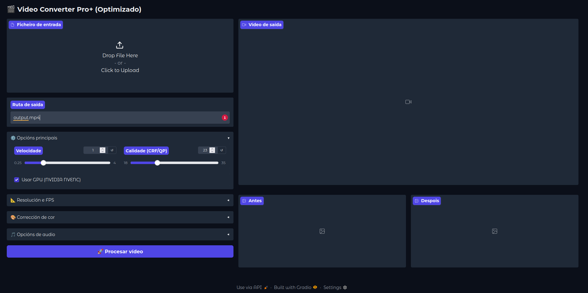

# Video-Converter-Gal

A user-friendly GUI for converting videos and animations, (designed for short videos, up to about 20 seconds), **with special support for animated WebP files**. Built with Python/Gradio and packaged as a portable AppImage for Linux. The UI is in Galician (Galego) and English.


*Note: You need to upload your `imaxe.png` file to the repository for this image to be displayed.*

## ✨ Features

* Easy video and image conversion powered by ffmpeg.
* **Reliably converts animated WebP files (the original motivation for the project!).**
* Adjust video speed and quality (CRF/QP).
* Color correction presets and manual adjustments (brightness, contrast, saturation).
* Scale video resolution.
* Audio mixing with fade-in/out effects for multiple tracks.
* GPU acceleration support (NVIDIA NVENC).

## 🚀 How to Use

1.  Go to the [**Releases page**](https://github.com/tonetxo/Video-Converter-Gal/releases).
2.  Download the latest `.AppImage` file.
3.  Make it executable:
    ```bash
    chmod +x Video-Converter-Gal-*.AppImage
    ```
4.  Run it:
    ```bash
    ./Video-Converter-Gal-*.AppImage
    ```

## 📄 License

This project is licensed under the MIT License. See the `LICENSE` file for details.
